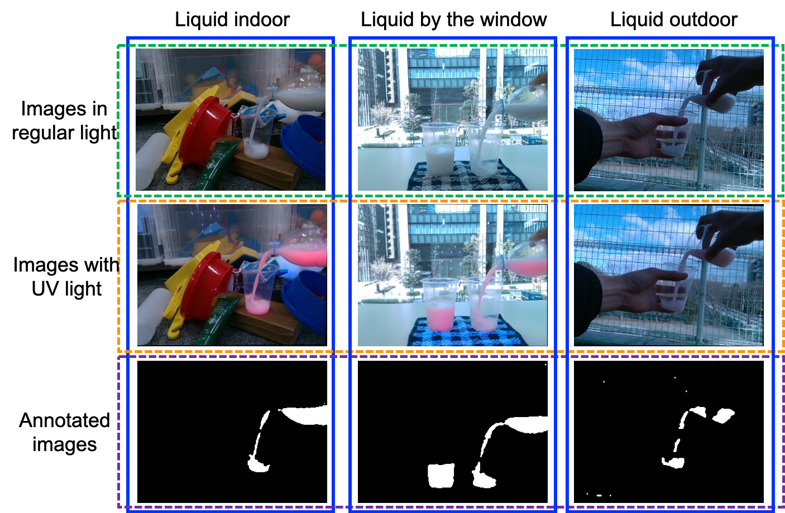

# PFN Invisible Marker Dataset
This dataset is a collection of semantic segmentation annotations of liquid for manipulation.  
[Download (dataset_invisible_marker.zip)](https://static.preferred.jp/datasets/iros2020/invisible_marker/dataset_invisible_marker.zip)

We collect datasets under uncontrolled environmental light conditions such as indoors, by the window, and outdoors.  
The dataset consists of RGB images under regular light conditions, RGB images under UV light conditions, and segmentation masks.  
There are 33 situations and 21645 pairs in total.

```
dataset_invisible_marker/
├── situation name/
    ├──sample number/
        ├── 0000_RGB.png
        ├── 0000_SEG.png
        ├── 0000_UV.png
        └── ....
```
## Citation:
Kuniyuki Takahashi*, Kenta Yonekura*: "Invisible Marker: Automatic Annotation of Segmentation Masks for Object Manipulation," 2020 IEEE/RSJ International Conference on Intelligent Robots and Systems(IROS2020), 2020  
(* The authors have contributed equally.)  
[paper content on arxiv](https://arxiv.org/abs/1909.12493)  
[paper content on YouTube](https://www.youtube.com/watch?v=fnpyDYUvDA4&feature=youtu.be)  
